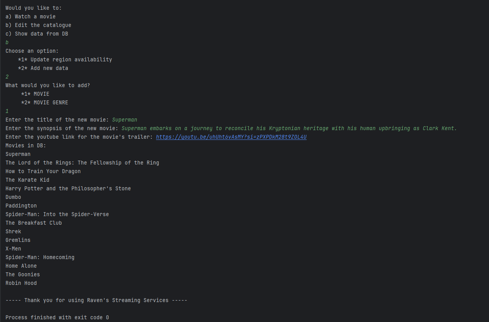

# Movie Streaming API
This project uses Flask to create an API where users can interact with a MySQL database in the terminal.

I have based my API off of streaming services. 
The user can interact with the app by searching for a movie to watch, 
browse through all the details within the DB, and there is limited editing capabilities to allow a user to manage the DB. 
I have also used the built-in Python library ```webbroswer``` to simulate a 'play' button, which will open a YouTube trailer for your chosen movie to watch if you agree (will appear dependent on region availability).

---
## How to run the API
*Please note: I have an additional database for bug reports, it is optional to use though. If you don't wish to use it, **DO NOT** select option **d) Submit bug report** and **DO NOT** choose to submit a report if asked to do so when adding a genre to a movie.*
### Project requirements
*Listed here are the installations and versions I have used for this assignment:*
- ```mysql-connector-python==9.2.0```
  - ```pip install mysql-connector-python```
- ```Flask==3.1.0```
  - ```pip install flask```
- ```requests==2.32.3```
  - ```pip install requests```


### Setting Up: 
#### 1. Copy & run the MySQL DB:
- Copy and paste the included ```movie_streaming.sql``` file into your preferred software for MySQL (I used MySQL Workbench). Run the whole file to create the DB.
- If you want to include the bug report database, do the same as above but for the ```bug_report_db.sql``` file.
#### 2. Copy & edit ```config.py```
    HOST = "localhost"
    USER = "root"
    PASSWORD = "YOUR_PASSWORD_HERE" # Replace with your password
- Change ```YOUR_PASSWORD_HERE``` to your password for the root user.

#### 4. Ensure flask, my-sql-connector and requests are installed in your VENV
- See project requirements above for the pip install commands to run in the terminal.

#### 5. Copy & run db_utils.py
- This it the file used to connect to the DB (with exception handling) and run the MySQL queries. 

#### 6. Copy & run app.py
- This is the Flask server that contains the API endpoints. You will need to keep this running while interacting with the API through main.py

#### 7. Copy & run main.py
- This is where the bulk of the program you will see is stored. It is how you will be asked for input and determines how responses from the API will be presented to you.

### Running the API
After setting up, you should be able to interact with the API repeatedly as long as the ```app.py``` file is running, and then you can continue re-running main.py.

### What is supposed to happen?
There will be a welcome opening message, then you will be asked how you want to interact with the API. Finally, a closing message will print to the terminal.
I have tried to ensure error handling and prevention for user input and also so that any requests made for data that is not in the DB will result in a message like 'this does not exist in the DB'.
Please let me know if you find anything I have missed though!

---
#### WATCH A MOVIE
Allows you to search:
- For a specific movie by name
- For a random choice that is filtered by your region
- Based on a broader term like genre/director/actor/production company, which *can* return multiple options for you to choose from

---
#### EDIT THE CATALOGUE
*Where changes have been made, the program usually returns the updated changes for you to see evidence of a successful change.*
- ##### UPDATE REGION AVAILABILITY
    Allows you to add or remove a film's availability within a region.
    I have just used the continents as regions (not including Antarctica - sorry penguins 🐧😓).
    You can also see all available regions for a specified film, or retrieve the ID of a film to use for the add/remove options.

- ##### ADD NEW DATA
  - ###### MOVIE:
    - Allows you to add a new movie to the DB, will ask for your input on the movie's title, synopsis, and a link to a YouTube trailer for the movie.

  - ###### MOVIE GENRE:
    - Allows you to add a genre to an existing movie (including new genres).

---
#### SHOW DATA FROM DB
This will show you all the movies/directors/actors/genres/production companies that are within the DB.

---
## Example searches
I have added screenshots to the new streaming-api-images folder to show examples:

**Watch Movie (search by title example):**


---

**Search by Actor Example:**


---

**Find ID Example:**


---

**Add Region Example:**


---

**Add Region Evidence:**


---

**Add New Movie Example:**



---

**Add New Genre Example:**


---

**Add New Movie/Genre Evidence:**


---

**Show All Data Example:**

